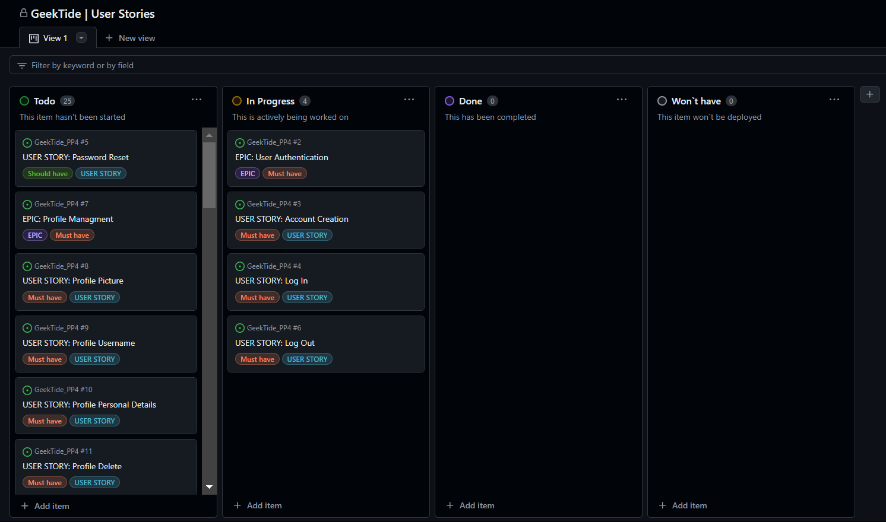

# GeekTide

## Introduction

### [GeekTide Live]()

## About us

DevTide is an innovative web platform designed to be your comprehensive hub for all IT-related content. Here, you can easily find up-to-date information on a wide range of IT topics, including the latest trends, best practices, and important updates. The platform offers users the ability to post and discuss technology news, share their own research and discoveries, and stay informed about the latest events and trends in the industry.

## Content:

- ### Project: Managment & Goals
  - [Project Goals](#project-goals)
  - [Audience](#audience)
  - [Agile Methodology](#agile-methodology)
  - [User Stories](#user-stories)

- ### Design & Features
  <!-- - [Wireframes](#wireframes)
  - [Features](#features)
    - 
    - 
    - 
    - 
  - [Database Schema](#database-schema) -->
  - [Colour Schema](#colour-schema)
  - [Images](#images)
  - [Typography](#typography)
  
- ### Testing & Deployment
  - [Testing](#testing)
  - [Deployment](#deployment)

- ### Credits & Acknowledgements
  - [Credits](#credits)
    - [Languages used](#)
    - [Software](#)
    - [Education](#)
  - [Acknowledgements](#acknowledgements)

## Project Goals

The purpose of GeekTide is to offer dynamic platform for its users, owners, and administrators by offering a space for knowledge sharing, news updates, and resource discovery in the IT field.
  
  ### User Goals
  - **Access to Information:** Provide users with easy access to a wide range of IT-related content
  - **Community:** Enable users to actively participate in discussions, share their insights, ask questions, and contribute valuable content to the platform.

  ### Owner Goals
  - **Innovation:** Continuously improve and innovate the platform by introducing new features, enhancing user experience, and staying current with industry trends.
  - **Monetization:** Develop strategies for monetizing the platform (e.g., through ads, premium features, partnerships) while maintaining a user-friendly experience and ensuring the long-term sustainability of the project.

  ### Admin Goals
  - **Community Moderation:** Maintain a positive and productive environment by moderating discussions, ensuring that all users behave as expected
  - **Content Management:** Oversee all the content, ensuring that it is properly categorized, up-to-date, and accessible to users.
  - **User Support:** Provide timely support to users, addressing any technical issues, answering questions, and ensuring a smooth experience on the platform.

[Go upwards ⇧](#content)

## Audience

GeekTide is for anyone passionate about technology, whether you're a professional or just starting out. Our platform is designed for:

- **Developers:** Get the latest news, find helpful resources, and download free software to improve your coding skills and productivity.
- **IT Enthusiasts:** Stay updated on tech trends, share your knowledge, and connect with like-minded people in the community.
- **Students & Learners:** Access a wealth of information to support your studies, learn new skills, and explore the world of technology.

[Go upwards ⇧](#content)

## Agile Methodology

### MoSCoW prioritization

In development process, I followed Agile principles to ensure flexibility and continuous improvement. I used the MoSCoW method to prioritize features and tasks. This method helped me to focus on what’s most important.

| Priority Level   | Description                                                                                           |
| ---------------- | ----------------------------------------------------------------------------------------------------- |
| **Must Have**    | Essential features that are critical for the platform's core functionality and success.                |
| **Should Have**  | Important features that add significant value but can be delayed if necessary without major impact.    |
| **Could Have**   | Nice-to-have features that enhance the user experience but are not essential for the initial launch.    |
| **Won't Have**   | Features that are either not needed for this phase or have been deprioritized for future consideration. |

### GitHub Projects

I used GitHub Projects to organize and track my development progress. This helped me to manage tasks, prioritize work, and stay on schedule. My project board is divided into columns, such as "To Do", "In Progress", "Done", and "Won`t have" allowing me to visualize the workflow and ensure that nothing is left behind.

GitHub Projects Image

### User Stories

|Epic   Id | Epic name                  | User   Story   Id | User Story name               |
|-------------|----------------------------|-------------------------|-----------------------------------------|
| #2          | User Authentication        | #3                      | Account Creation                        |         
| #2          | User Authentication        | #4                      | Login                                   |         
| #2          | User Authentication        | #5                      | Password Reset                          |
| #2          | User Authentication        | #6                      | Log out                                 |
| #7          | Profile Management         | #8                      | Profile Picture                         |
| #7          | Profile Management         | #9                      | Profile Username                        |
| #7          | Profile Management         | #10                     | Profile Personal Details                |
| #7          | Profile Management         | #11                     | Profile Delete                          |
| #7          | Profile Management         | #12                     | Profile Password Change                 |
| #13         | Content Discovery          | #14                     | Content Scroll Lane                     |   
| #13         | Content Discovery          | #15                     | Content Search Bar                      |
| #13         | Content Discovery          | #16                     | Content Sorting                         |
| #13         | Content Discovery          | #17                     |  Bookmark                               |
| #13         | Content Discovery          | #18                     | Adaptive Navigation Sidebar             |
| #13         | Content Discovery          | #19                     | Logo Leading to Home Page               |
| #20         | Community Engagement       | #21                     | Posting Content                         | 
| #20         | Community Engagement       | #22                     | Comments                                |
| #20         | Community Engagement       | #23                     | Post/Comment Score System               |
| #20         | Community Engagement       | #24                     | Report System                           |
| #20         | Community Engagement       | #25                     | Private Messages                        |
| #20         | Community Engagement       | #26                     | Groups/Communities                      |
| #27         | Admin Tools                | #28                     | Reported Content                        |
| #27         | Admin Tools                | #29                     | Comment/Post Deleting                   |
| #27         | Admin Tools                | #30                     | User Support Chat                       |

[Go upwards ⇧](#content)

<!-- ## Wireframes

## Features

## Database Schema -->

## Colour Schema

[Coolors](https://coolors.co) was used to create colour palette. The design of the application follows a modern and minimalistic color scheme, using a combination of dark and light shades to create a visually appealing and user-friendly interface. The primary colors used throughout the application are:

These colors were chosen to create a clean and professional look while maintaining good readability and accessibility across different devices and screen sizes.

## Images

All images used in this application have been sourced from [Pinterest](https://ie.pinterest.com/) They have been selected to complement the overall design and aesthetic of the project, providing visual context and enhancing the user experience.

## Typography

The application uses a combination of the following fonts to create a clean and modern look:

- **Open Sans:** This sans-serif font is the primary typeface used throughout the site for its readability and contemporary feel. It is employed for most of the body text and user interface elements.

- **Arial:** As a widely available and versatile sans-serif font, Arial is used as a fallback for text elements when Open Sans is not available.

- **Sans-serif:** A general sans-serif font family is used as a fallback to ensure text remains legible and consistent across different devices and browsers.

These fonts were chosen to maintain clarity, readability, and a cohesive design aesthetic across the application.

## Testing

## Deployment

### Pre Deployment

The hidden variables are as follows

- SECRET_KEY
- DATABASE_URL
- CLOUDINARY_URL
- PORT

### Deploying on Heroku

1. Create a Heroku account.
2. Sign up with a student account for credits. (optional)
3. Once logged in, select create a new app.
4. Select an app name and region.
5. Select deployment method as connect to github.
6. Find the desired repo.
7. Enable automatic deploys and select the main branch
8. In the settings tab select reveal config vars. Input the required hidden variables.
9. Select nodejs and python as the buildpack.
10. Deploy.

### Fork The Repository

1. Go to the GitHub repository
2. Click on Fork button in the upper right-hand corner
3. Edit the repository name and description if desired
4. Click the green create fork button

### Clone The Repository

1. Go to the GitHub repository
2. Locate the green Code button above the list of files and click it
3. Select if you prefer to clone using HTTPS, SSH, or Github CLI and click the copy button to copy the URL to your clipboard
4. Open Git Bash
5. Change the current working directory to the one where you want the cloned directory
6. Type git clone and paste the URL from the clipboard ($ git clone https://github.com/YOUR-USERNAME/YOUR-REPOSITORY)
7. Press Enter to create your local clone.

### Run The Repository Locally

1. Go to the GitHub repository
2. Locate the green Code button above the list of files and click it
3. From the dropdown menu select download Zip.
4. Download and open the zip file to run in an editor
5. Create an env.py file and input the environment variables
6. Ensure [PostgreSQL](https://www.postgresql.org/) is install on your computer and ports are open
7. Create a virtual environment for installing the python modules in the pip file.
8. Run python3 makemigrations, migrate and runserver

## Credits

## Acknowledgments