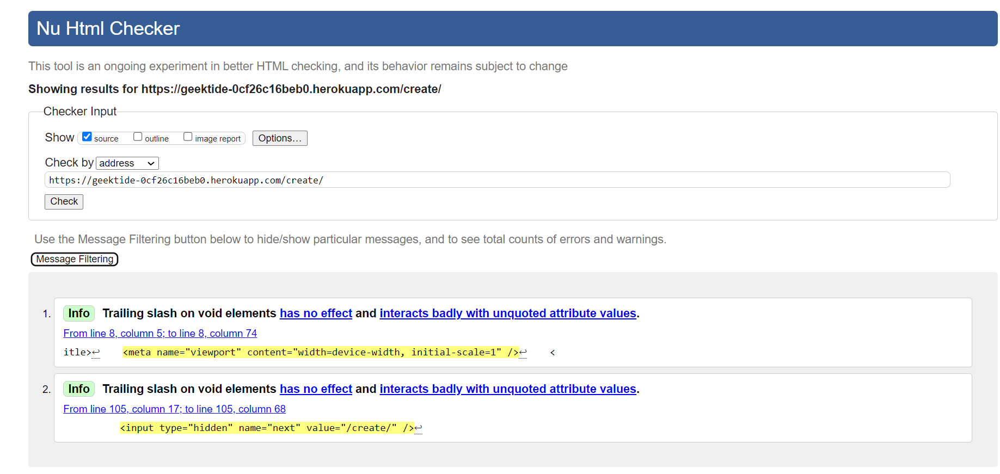
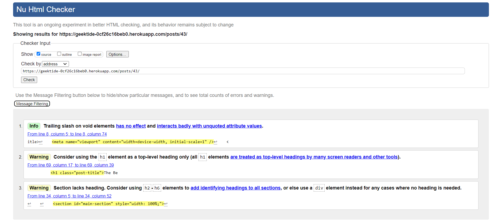
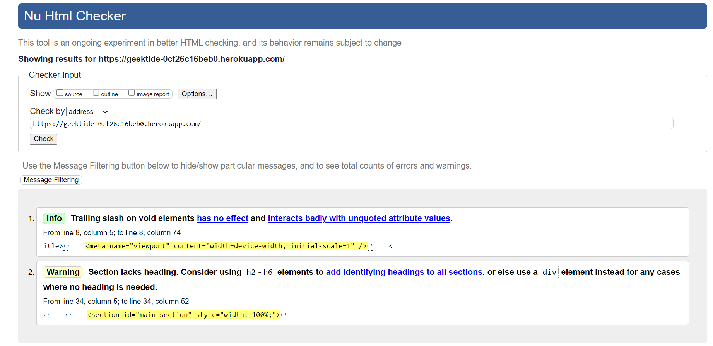
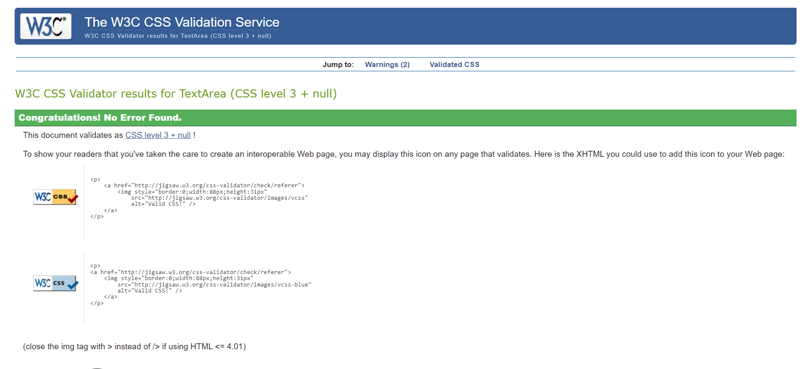
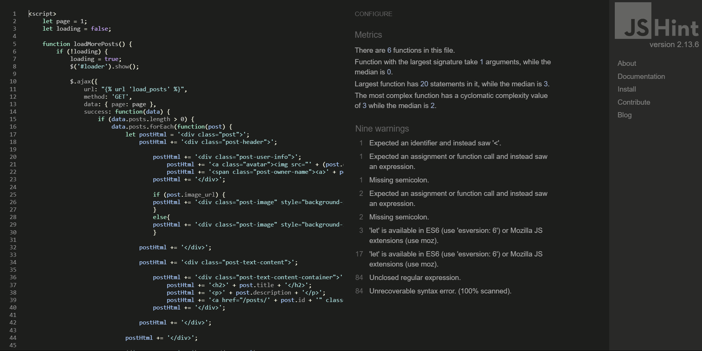
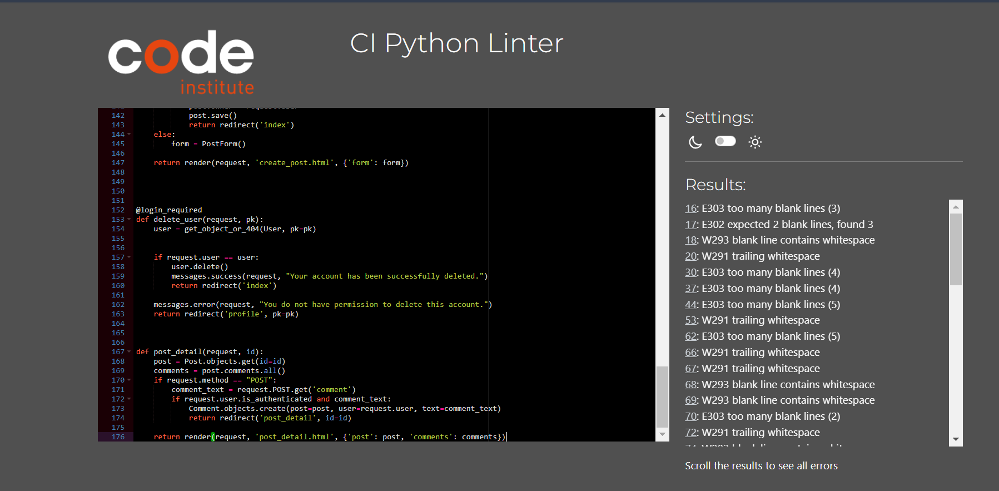

# Testing Page

**Authentication**

Description:

Ensure a user can sign up to the website

Steps:

1. Navigate to [GeekTide](https://geektide-0cf26c16beb0.herokuapp.com/register/)
2. Enter email, username, display name and password 
3. Click Register

Expected:

Users can sign up and registration is successful

Actual: 

Users can sign up and registration is successful

Description:

Ensure a user can log in once signed up

Steps:
1. Navigate to [GeekTide](https://geektide-0cf26c16beb0.herokuapp.com/login/)
2. Enter login details created in previous test case
3. Click login

Expected:

User is successfully logged in 

Actual:

User is successfully logged in

Description:

Ensure a user can sign out

Steps:

1. Login to the website
2. Go to profile
2. Click the logout button

Expected:

User is logged out

Actual:

User is logged out

**Post/Comment**

Description:

Ensure that loged in user can create a post

Steps:

1. Login to the website
2. Click Create Post button
3. Fill the form

Expected:

Post is created

Actual:

Post is created

Description:

Ensure that loged in user can leave a comment

Steps:

1. Login to the website
2. Click a button on any post
3. Fill the textarea field and press Submit

Expected:

Comment is created

Actual:

Comment is created

**Navigation Links**

Testing was performed to ensure all navigation links on the respective pages, navigated to the correct pages as per design. This was done by clicking on the navigation links on each page.

Logo -> index.html - Visible to all

Create Post -> create_post.html - Visible to logged in users

Edit Profile -> edit_profile.html - Visible to logged in users

Login -> login.html - Visible to all

Post Button -> post_detail.html - Visible to all

Profile Icon -> profile.html - Visible to logged in users

Register -> register.html - Visible to all

All navigation links directed to the corect pages as expected.

## Code Vallidation

### HTML

### CSS

### JavaScript

### Python

